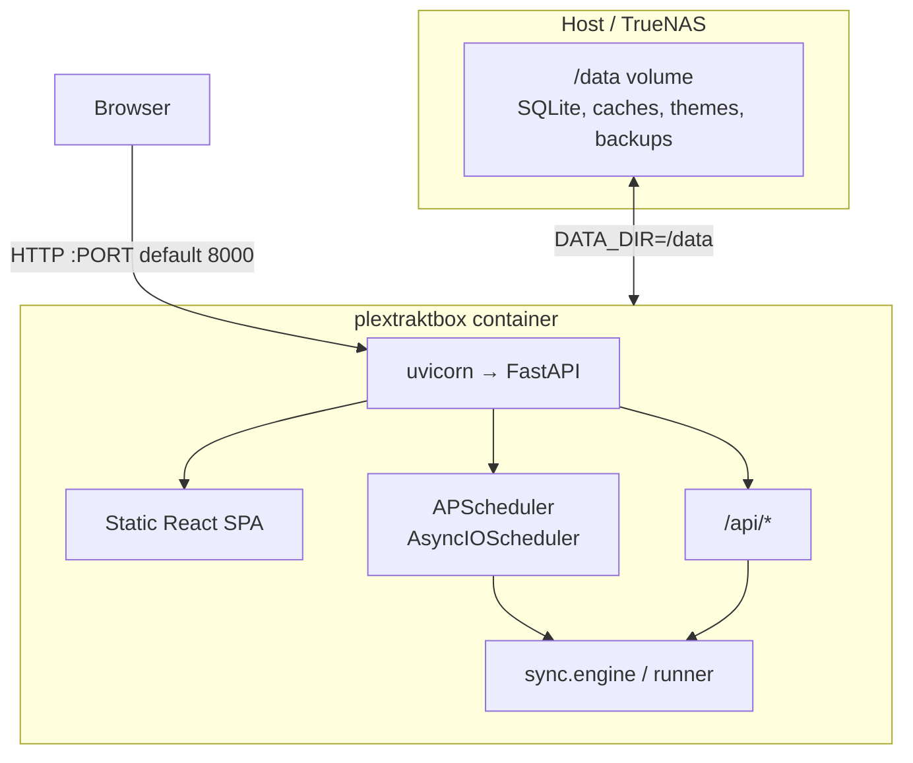
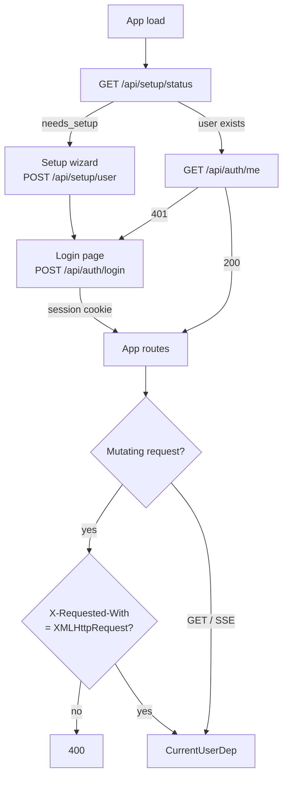
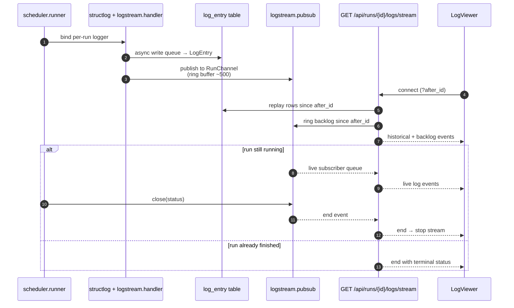
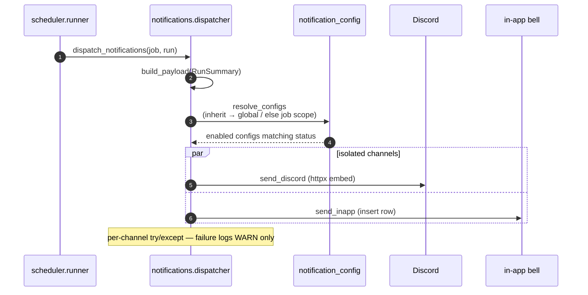
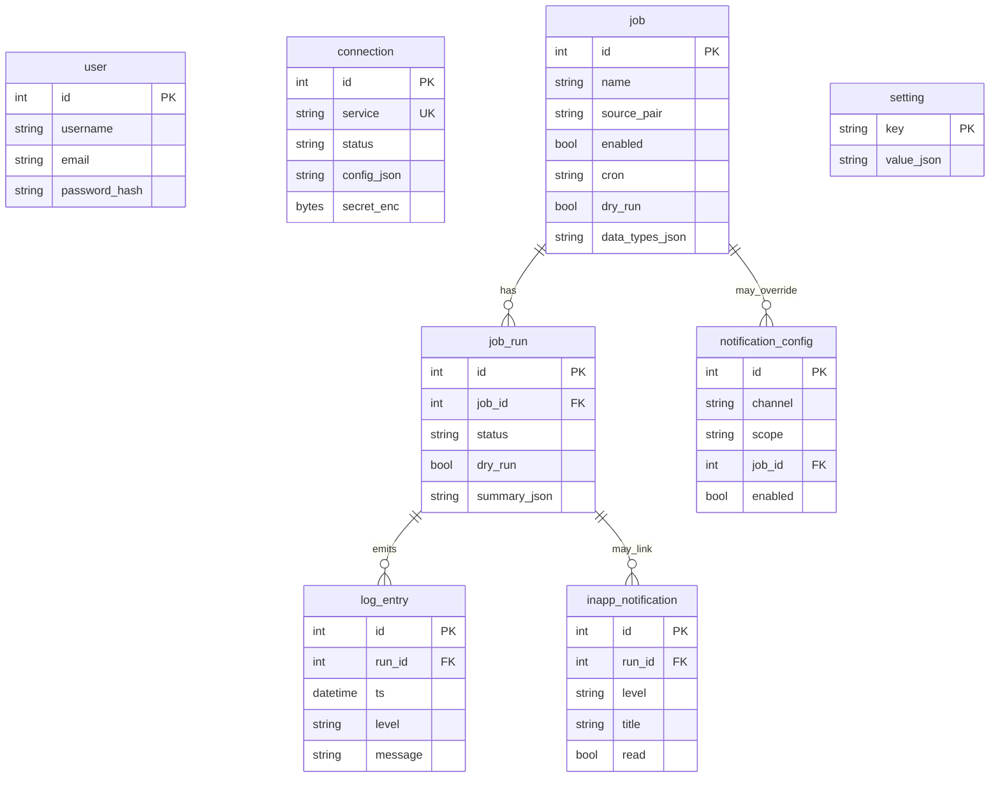

# App flows

Visual companion to [architecture.md](architecture.md) for non-sync paths: container shape,
auth/setup, live logs, notifications, and the SQLite data model.

Sync job diagrams live in [sync-flows.md](sync-flows.md).

## Container / process shape

One Docker image, one process tree: FastAPI serves the built SPA and API, APScheduler runs
in-process, SQLite + caches live on the `/data` volume (ZFS mount on TrueNAS).

Listen port defaults to **8000** (`PORT` env). Secrets stay in env / Fernet-encrypted DB columns —
never baked into the image.

---

## First-run / auth gate

Single local user. Until that user exists, the SPA is locked to the setup wizard; afterward,
session cookie auth gates the app. Mutating API calls also require `X-Requested-With: XMLHttpRequest`
(CSRF).

Public exceptions: `/api/setup/*` (self-disables once a user exists) and `/api/health`.

---

## Live log streaming

Per-run structlog → persist + publish → SSE to the React LogViewer. Reconnect uses `?after_id=`
so clients resume without duplicates.

UI reconnects with `fetch-event-source` and the last seen `after_id`. Completed runs can also
page historical rows via REST through the same LogViewer component.

---

## Notification fan-out

Called at run finalize (never aborts the run). Job `notify_mode` chooses inherit (global configs)
vs job-scoped configs vs disabled; each matching channel is sent concurrently and isolated.

`POST /api/notifications/{id}/test` sends a synthetic payload through the same path.

---

## Data model (SQLite)

Core tables and relationships. Sync caches (`letterboxd_slug_cache`, `trakt_list_cache`,
`plex_discover_key_cache`) and APScheduler’s `apscheduler_jobs` share the same DB file under
`/data`.

`user` is a single-row table (enforced in app); `connection` is one row per service (unique
`service`) with no FK to user. `connection.secret_enc` is Fernet-encrypted (key derived from
`SECRET_KEY`). Job ↔ run and run ↔ log links are by indexed `job_id` / `run_id` (not ORM
relationships).
