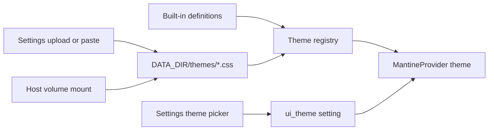

# Phase 24 — UI themes

**Status:** Done

## Goal

Add selectable UI themes on top of Mantine — built-in Atom One Dark Pro (factory default),
Cinema Night, Nord, and Dracula palettes, plus user-defined themes via Settings upload/paste
**or** a Docker volume under `{DATA_DIR}/themes/`.

Stay on **Mantine** (no redesign). Themes are palettes applied through `MantineProvider` + CSS
variables, not a new UI kit.

## Decisions locked

- **Built-ins:** `one-dark-pro` (factory default), `cinema-night`, `nord`, `dracula`
- **Custom themes:** Settings upload/paste **and** optional host volume at `/data/themes`
- **Persistence:** Active theme id in Phase 13 `setting` table (`ui_theme`); fall back to
  `one-dark-pro` if unset or a custom file is missing
- First-party theme definitions (credit/license in file headers where relevant) — not scraped from
  external repos
- Dark-only for v1 (no light-mode toggle)

## Deliverables

### Built-in themes

| Id | Name | Notes |
| -- | ---- | ----- |
| `one-dark-pro` | Atom One Dark Pro | Factory default — Binaryify/One Dark Pro palette |
| `cinema-night` | Cinema Night | Amber + charcoal “cinema night” look |
| `nord` | Nord | Nord polar night / frost accents |
| `dracula` | Dracula | Dracula purple/pink accents |

Ship as `createTheme()` configs under `frontend/src/themes/`.

### Custom themes (upload + volume)



- **Format:** CSS files with metadata headers + Mantine CSS variable overrides:

  ```css
  /* @name: My Theme */
  /* @id: my-theme */
  :root[data-ptb-theme="my-theme"] {
    --mantine-color-dark-0: #abb2bf;
    /* dark-0..9, optional primary scale, optional --ptb-body-gradient */
  }
  ```

  Id from `@id` (else sanitized filename); built-in ids are reserved.

- **Discovery:** Scan `{DATA_DIR}/themes/*.css` on each list request. Uploaded files land in the
  same directory so both paths share one registry.
- **API:**
  - `GET /api/themes` — list id / name / source (`builtin` \| `custom`)
  - `PUT /api/settings/theme` — set active id
  - `POST /api/themes` — upload body
  - `DELETE /api/themes/{id}` — custom only (never delete built-ins)
  - `GET /api/themes/{id}/css` — serve custom CSS for SPA inject
- **Safety:** Cap file size (64KB); reject path traversal; only allow registered custom ids; inject
  as a scoped stylesheet (not eval)

### UI

- Theme section on Settings: swatches for built-ins + custom, upload, delete custom, refresh
- `MantineProvider` wired from registry + preferred id (`forceColorScheme="dark"`)
- Body gradient via `--ptb-body-gradient` so each theme can override atmosphere

### Deploy docs

- TrueNAS / compose volume example for `/data/themes` in [deploy/truenas.md](../deploy/truenas.md)

## Key files

- `frontend/src/themes/` — built-in definitions + registry
- `frontend/src/pages/Settings/ThemeSection.tsx` — theme picker
- `frontend/src/themes/ThemeProvider.tsx` — `MantineProvider` wiring
- `backend/plextraktbox/api/themes.py` — list / upload / delete / css
- `backend/plextraktbox/api/settings.py` — `ui_theme` get/set
- `{DATA_DIR}/themes/*.css` — custom theme files

## Prerequisites

- [Phase 13](phase-13.md) — Settings page + `setting` table for `ui_theme`

## Out of scope

- Full frontend redesign / leaving Mantine
- Community theme catalog / marketplace
- Per-job or per-page themes
- Accent-color variation pickers (Material-style) for v1
- Light color scheme toggle

## Verification

[test-plans/phase-24-test-plan.md](test-plans/phase-24-test-plan.md)

**Next:** [Phase index](README.md) — TrueNAS (22–23) and sync caches (21) remain planned.
