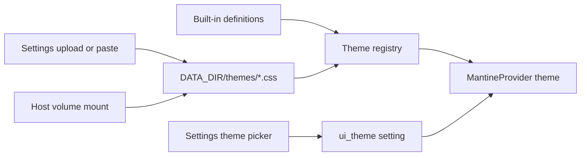

# Phase 24 — UI themes

**Status:** Planned

## Goal

Add selectable UI themes on top of Mantine — built-in Atom One Dark, Nord, and Dracula palettes,
plus user-defined themes via Settings upload/paste **or** a Docker volume under
`{DATA_DIR}/themes/`. Last on the roadmap so product, ops, and TrueNAS settle first; can ship
anytime after [Phase 13](phase-13.md) if themes are needed earlier.

Stay on **Mantine** (no redesign). Themes are palettes applied through `MantineProvider` + CSS
variables, not a new UI kit.

## Decisions locked

- **Built-ins:** `default` (current Mantine dark), `one-dark`, `nord`, `dracula`
- **Custom themes:** Settings upload/paste **and** optional host volume at `/data/themes`
- **Persistence:** Active theme id in Phase 13 `setting` table (`ui_theme`); fall back to
  `default` if a custom file is missing
- First-party theme definitions (credit/license in file headers where relevant) — not scraped from
  external repos

## Deliverables

### Built-in themes

| Id | Name | Notes |
| -- | ---- | ----- |
| `default` | Default | Keep today’s Mantine dark (enable light if schema supports both) |
| `one-dark` | Atom One Dark | Classic Atom palette |
| `nord` | Nord | Nord polar night / frost accents |
| `dracula` | Dracula | Dracula purple/pink accents |

Ship as CSS variable maps and/or `createTheme()` configs under something like
`frontend/src/themes/`.

### Custom themes (upload + volume)

- **Format:** CSS files with metadata + token variables (qui-inspired `:root` / `.dark` style),
  documented in this phase doc and a short README note
- **Discovery:** On startup (and optional “Refresh themes” in Settings), scan
  `{DATA_DIR}/themes/*.css`. Uploaded files land in the same directory so both paths share one
  registry
- **API:**
  - `GET /api/themes` — list id / name / source (`builtin` \| `custom`)
  - `PUT /api/settings/theme` — set active id
  - `POST /api/themes` — upload body
  - `DELETE /api/themes/{id}` — custom only (never delete built-ins)
- **Safety:** Cap file size; reject path traversal; only allow registered custom ids; inject as a
  scoped stylesheet (not eval)

### UI

- Theme section on Settings (after Phase 13): swatches/list for built-ins + custom, preview,
  upload, delete custom, link to volume path docs
- Wire `MantineProvider` in `frontend/src/main.tsx` from registry + preferred id (replace bare
  `defaultColorScheme="dark"`)

### Deploy docs

- Optional TrueNAS / compose volume example for `/data/themes` in [deploy/truenas.md](../deploy/truenas.md)
  ([Phase 22](phase-22.md) doc touch-up when that phase lands, or here)

## Key files (expected)

- `frontend/src/themes/` — built-in definitions + registry
- `frontend/src/pages/SettingsPage.tsx` — theme picker section
- `frontend/src/main.tsx` — `MantineProvider` wiring
- `backend/plextraktbox/api/themes.py` — list / upload / delete
- `backend/plextraktbox/api/settings.py` — `ui_theme` get/set (with Phase 13 settings)
- `{DATA_DIR}/themes/*.css` — custom theme files

## Prerequisites

- [Phase 13](phase-13.md) — Settings page + `setting` table for `ui_theme`
- [Phase 22](phase-22.md) (docs only) — optional volume example for `/data/themes`

## Out of scope

- Full frontend redesign / leaving Mantine
- Community theme catalog / marketplace
- Per-job or per-page themes
- Accent-color variation pickers (Material-style) for v1

## Verification

Test plan TBD when phase lands — copy [phase-test-plan-template.md](test-plans/phase-test-plan-template.md).

**Next:** [Phase index](README.md) — end of the planned roadmap.
