# Sync job flows

Visual companion to [architecture.md](architecture.md). How a job run moves through the
scheduler → engine → sources/reconcilers, and what each data type reads and writes.

Jobs are **per source pair** (`plex_trakt`, `letterboxd_plex`, `letterboxd_trakt`) and enable a
subset of data types. Reconcilers hard-code source-of-truth; Letterboxd is always read-only.

## Source of truth at a glance

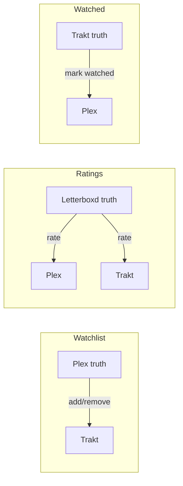

| Data type | Truth | Writes | Notes |
| --------- | ----- | ------ | ----- |
| Watchlist | Plex | Trakt add/remove | Letterboxd watchlist is ignored (not fetched) |
| Ratings | Letterboxd (0.5–5 → 0–10 at fetch) | Plex (library or Discover), Trakt | Trakt: only update items already in Trakt ratings |
| Watched | Trakt | Plex library mark watched | Unmatched library titles are skipped; LB diary is not a write target |

## Job pairs → services

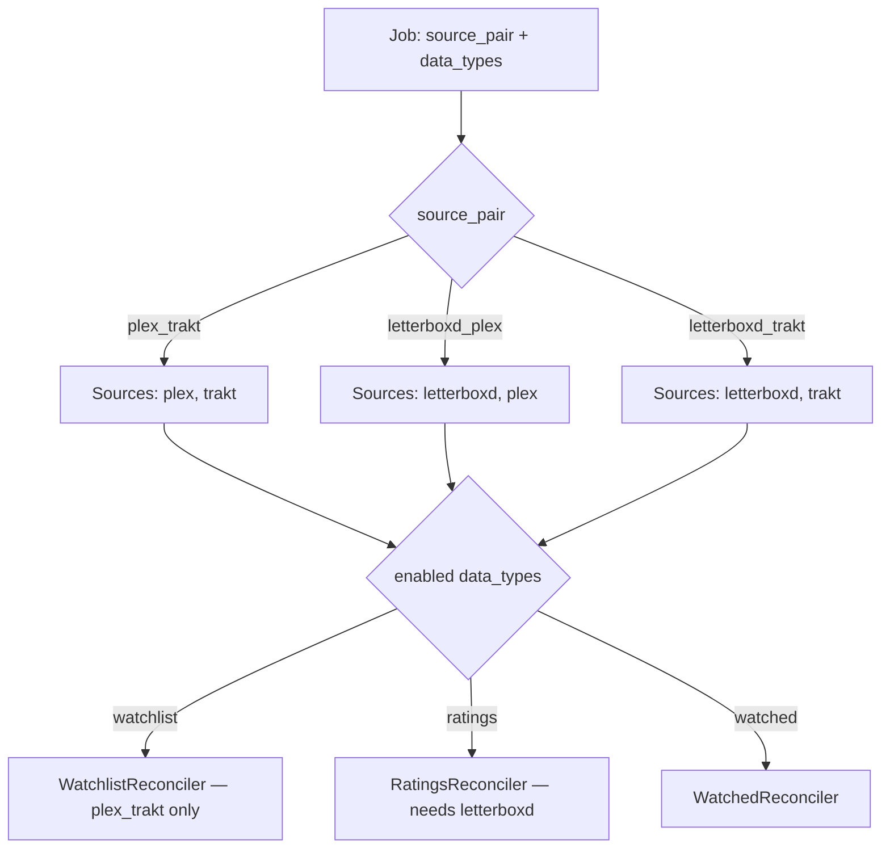

Validation (from `Job.validate_data_types`): watchlist requires `plex_trakt`; ratings requires
Letterboxd in the pair.

## Run lifecycle

End-to-end path for every scheduled or “run now” execution.

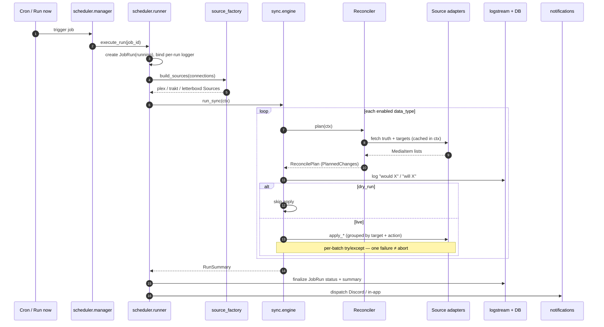

Inside the engine, the shape is always **fetch → plan → log → apply**:

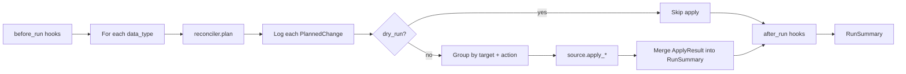

## Matching

Items are matched **statelessly** by identifier priority (no persisted Plex↔Trakt mapping table):

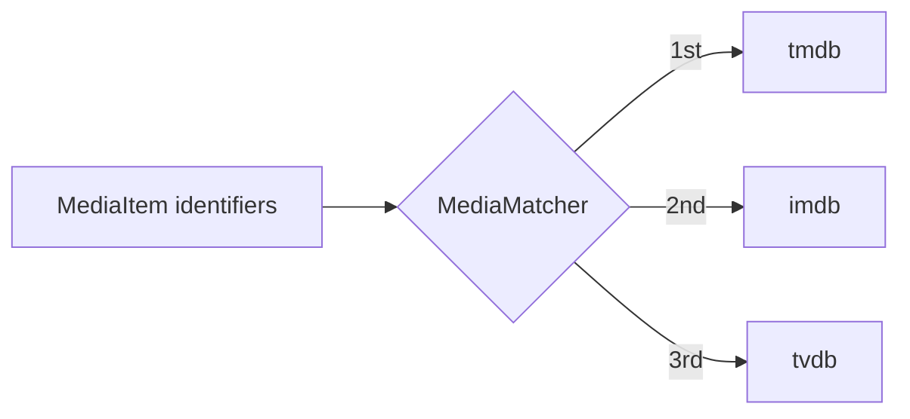

Letterboxd titles resolve `letterboxd.com/...` → TMDB id (via TMDB client) → `tmdb://` before match.

**Planned ([Phase 21](phases/phase-21.md)):** Letterboxd CSV export TTL + slug→ids; Trakt list TTL;
Plex Discover key map; Plex library loaded once per run. Cross-service matching remains ID-based.

---

## Watchlist — Plex → Trakt

**Job:** `plex_trakt` with `watchlist` enabled.  
**Truth:** Plex. **Write target:** Trakt. Letterboxd watchlist is not loaded for `plex_trakt` jobs.

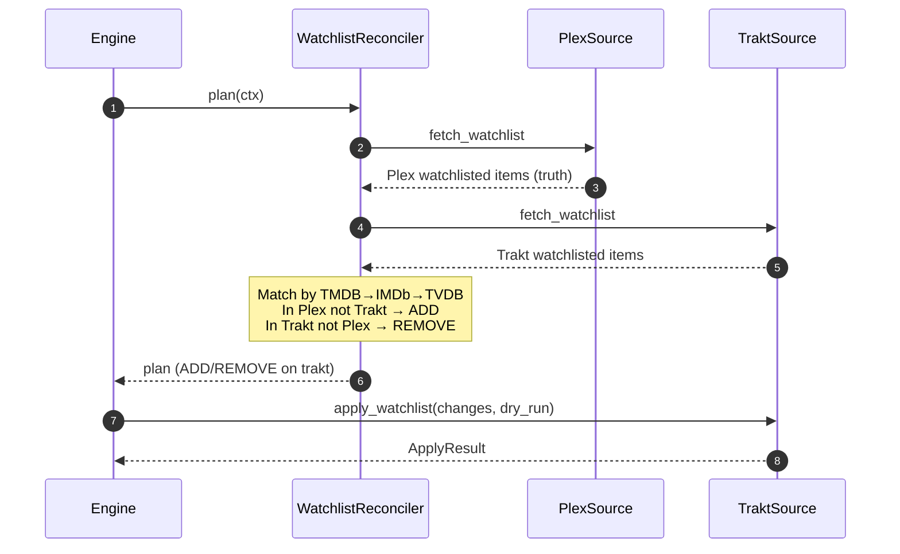

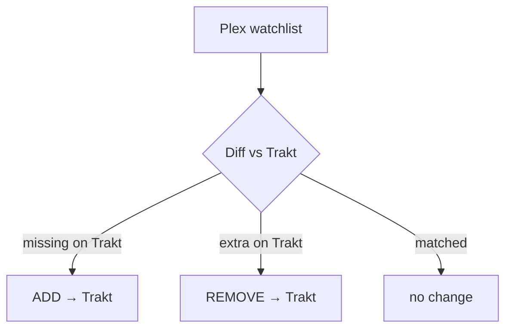

---

## Ratings — Letterboxd → Plex + Trakt

**Jobs:** `letterboxd_plex` and/or `letterboxd_trakt` with `ratings` enabled.  
**Truth:** Letterboxd. **Write targets:** Plex and/or Trakt (whichever sources are in the job).

Ratings are normalized to **0–10** when building Letterboxd `MediaItem`s (stars × 2).

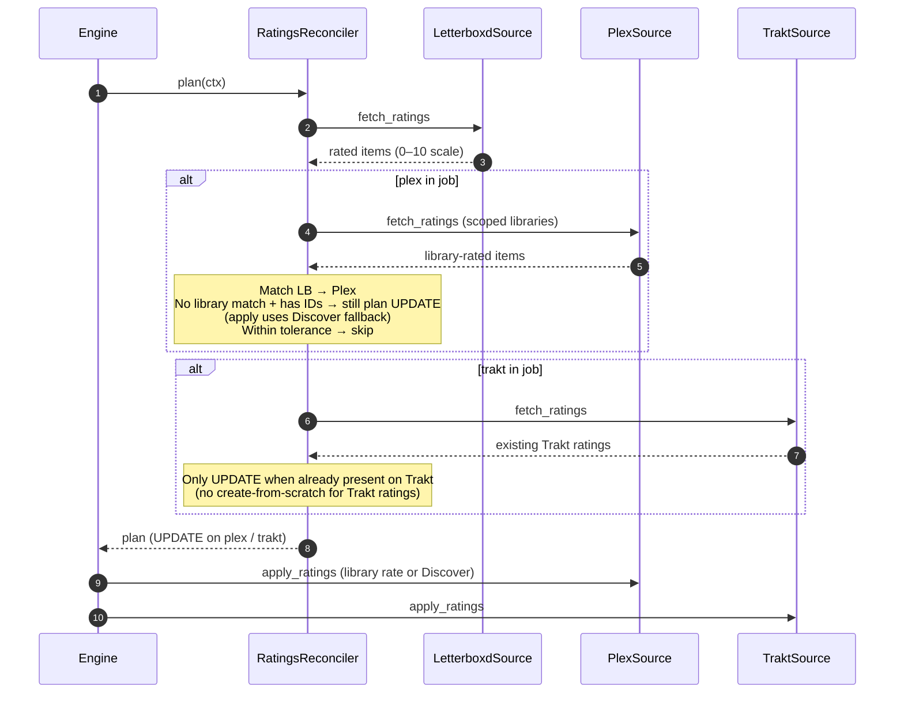

### Plex apply: library vs Discover

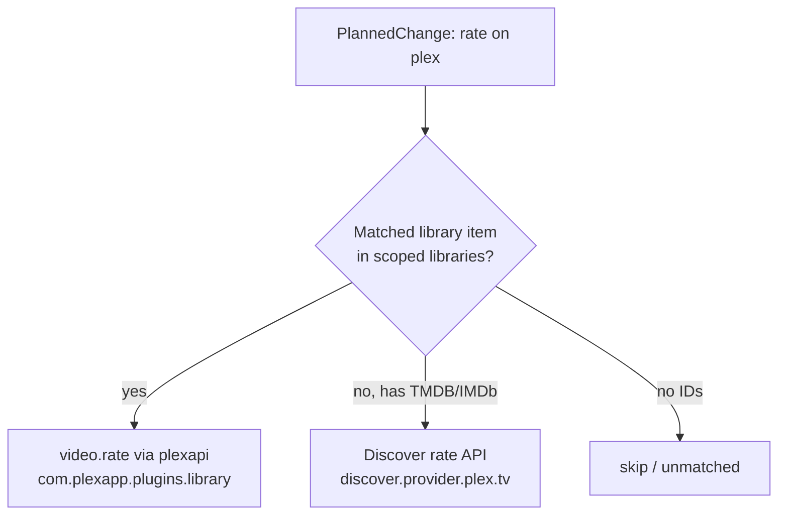

Friend-shared libraries are **not** your library — ratings land on Discover metadata, not the
shared server’s library page. See [architecture.md](architecture.md#plex-ratings-discover-vs-library).

---

## Watched — Trakt → Plex

**Job:** typically `plex_trakt` with `watched` enabled.  
**Truth:** Trakt. **Write target:** Plex (library mark watched). Only items that already exist in
the scoped Plex library are planned.

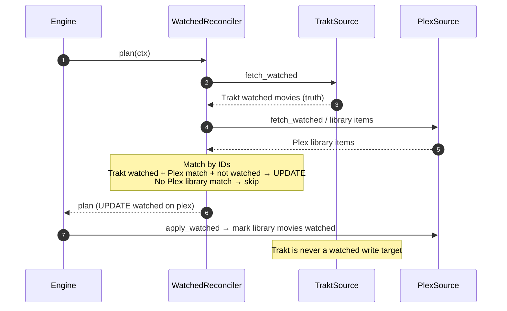

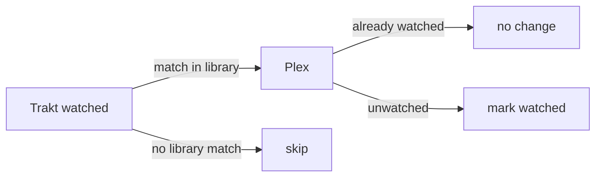

---

## Dry-run

Dry-run is resolved per run: `override ?? job.dry_run ?? global`. The same plan and log path run;
apply is skipped and messages use **“would …”** instead of **“will …”**. Zero third-party writes.

## Where the code lives

| Step | Code |
| ---- | ---- |
| Trigger + JobRun | `scheduler/runner.py` |
| Build sources | `services/source_factory.py` |
| Orchestration | `sync/engine.py` |
| Plans | `sync/reconcilers/{watchlist,ratings,watched}.py` |
| Fetch / apply | `sync/sources/{plex,trakt,letterboxd}_source.py` + `clients/` |
| Match | `sync/matcher.py`, `sync/guid.py` |
